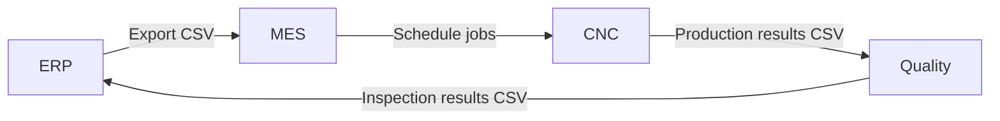
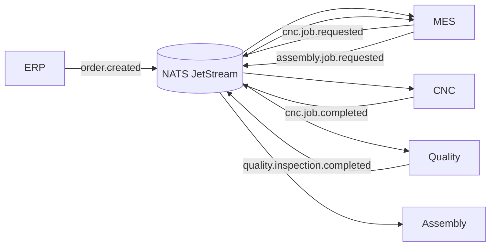
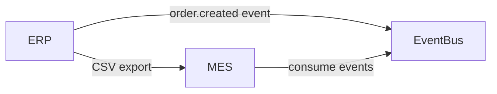
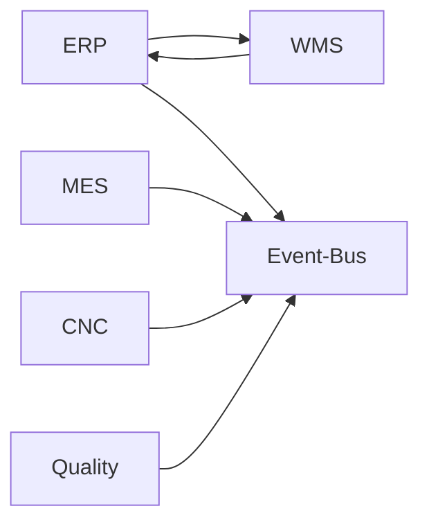

# ADR-000: Migration from CSV Batch Integration to Event-Driven Architecture

**Status:** Accepted  
**Date:** 2026-03-10

---

## Context

The current manufacturing integration model relies on **CSV batch file exchanges** between systems such as ERP, MES, CNC controllers, and Quality systems.

Typical workflow in the existing system:

1. ERP exports order data as CSV files.
2. MES periodically imports CSV files to create work orders.
3. CNC machines execute jobs scheduled by MES.
4. Quality inspection results are exported as CSV files.
5. ERP imports the results to update production status.

This approach introduces several operational limitations:

- **High latency** — updates may take minutes or hours.
- **Fragile integrations** — CSV formats are prone to breaking when schemas change.
- **Poor traceability** — difficult to reconstruct the full lifecycle of an order.
- **Operational complexity** — batch jobs, cron schedules, and manual interventions are often required.
- **Limited scalability** — adding new systems requires additional CSV pipelines.

As manufacturing systems increasingly require **real-time visibility and automation**, the batch-based CSV model becomes a bottleneck.

---

## Decision

The system will transition from CSV batch integration to an **event-driven architecture** using **NATS JetStream** as the messaging backbone.

Instead of exchanging files, systems will publish and consume **domain events**.

Key events in the manufacturing workflow:

- `order.created` - ERP publishes new customer orders with inventory reservation details
- `mes.workorder.created` - MES creates internal work orders from customer orders
- `cnc.job.requested` - MES requests CNC machining for work orders
- `cnc.job.started` - CNC machine begins processing a machining job
- `cnc.job.completed` - CNC machine completes machining with duration and status
- `quality.inspection.requested` - MES requests quality inspection after CNC completion
- `quality.inspection.completed` - Quality system reports inspection results with pass/fail details
- `wms.inventory.updated` - MES updates inventory when parts pass quality inspection
- `assembly.job.requested` - MES forwards passed parts to assembly station

Events will be persisted in **JetStream streams**, enabling:

- durable messaging
- event replay
- asynchronous decoupling between systems

The ERP–WMS interaction remains **synchronous** during order validation, as users require immediate feedback.

All downstream manufacturing operations are **event-driven**.

---

## Architecture Comparison

### Legacy CSV Workflow

### Event-Driven Architecture

---

## Migration Strategy

The migration from CSV batch workflows to event-driven integration will occur **incrementally** to minimize operational risk.

### Phase 1 — Event Backbone Introduction

Introduce NATS JetStream while maintaining existing CSV workflows.

Systems begin publishing events in parallel with CSV exports.

---

### Phase 2 — Dual Integration

Systems gradually migrate from CSV consumption to event consumption.

Both mechanisms operate simultaneously.

---

### Phase 3 — Event-First Architecture

Event streams become the primary integration mechanism.

CSV exports remain only for legacy compatibility.

---

### Phase 4 — CSV Retirement

CSV-based integrations are fully removed.

All systems communicate exclusively through the event-driven architecture.

---

## Consequences

### Positive

- Real-time system integration
- Improved scalability and system decoupling
- Easier integration of new services (analytics, monitoring, digital twins)
- Improved observability through event streams
- Simplified debugging via event replay

### Negative

- Increased architectural complexity
- Requires operational knowledge of messaging infrastructure
- Event-driven systems introduce eventual consistency

---

## Notes

The migration strategy prioritizes **incremental adoption and backward compatibility** to reduce risk during the transition from legacy batch processing to modern event-driven manufacturing systems.

This ADR establishes the **foundational architectural direction** for all subsequent decisions documented in ADR-001 through ADR-005.
