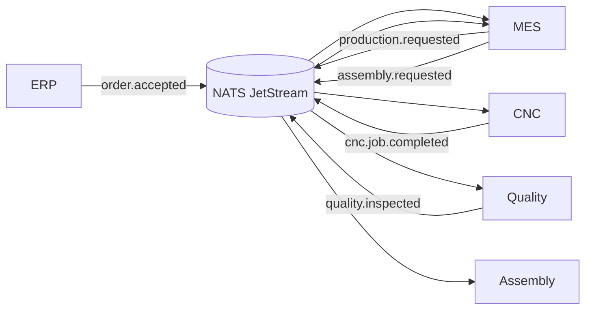

# ADR-001: Event‑Driven Architecture with NATS JetStream

**Status:** Accepted  
**Date:** 2026-03-10

---

## Context

The manufacturing system integrates several independent systems:

- ERP (order management and BOM expansion)
- WMS (inventory availability and reservation)
- MES (manufacturing orchestration)
- CNC machines (machining execution)
- Quality inspection systems
- Assembly

After an order is confirmed by ERP and inventory is reserved by WMS, the manufacturing workflow involves multiple systems that must communicate reliably and asynchronously.

Traditional integration approaches include:

- Direct synchronous REST/gRPC communication
- Polling between systems
- Point‑to‑point service integrations

However, these approaches create tight coupling between systems and make the system harder to scale and evolve.

Manufacturing workflows are naturally **event-driven**, where each system reacts to state changes produced by other systems.

Examples include:

- Order accepted
- Production requested
- CNC job completed
- Quality inspection result
- Assembly requested

To support this architecture, the system requires a reliable event streaming backbone.

---

## Decision

We will adopt an **event-driven architecture** using **NATS JetStream** as the central event bus.

All manufacturing systems communicate through events published to JetStream streams.

The following systems will produce and consume events:

- ERP publishes `order.accepted`
- MES publishes `production.requested`
- CNC publishes `cnc.job.started` and `cnc.job.completed`
- Quality publishes `quality.inspected`
- MES publishes `assembly.requested` or `production.retry_requested`

JetStream provides:

- durable event streams
- message persistence
- consumer replay capability
- horizontal scalability
- low latency messaging

The ERP–WMS interaction remains synchronous because the user is waiting for immediate feedback during order validation.

All downstream manufacturing operations are asynchronous and event‑driven.

---

## High-Level Event Flow



---

## Example Event Payload

### production.requested

```json
{
  "event_type": "production.requested",
  "order_id": "ORD-1001",
  "work_order_id": "WO-501",
  "part_id": "ObjA",
  "routing_step": "machining",
  "target_machine": "CNC-07"
}
```

### quality.inspected

```json
{
  "event_type": "quality.inspected",
  "work_order_id": "WO-501",
  "produced_part_id": "PART-9001",
  "result": "FAILED",
  "reason": "diameter_out_of_tolerance"
}
```

---

## Alternatives Considered

### Apache Kafka

Pros:
- industry standard event streaming platform
- strong ecosystem

Cons:
- heavier operational complexity
- requires more infrastructure management

### RabbitMQ

Pros:
- mature message broker
- flexible routing

Cons:
- not optimized for event streaming and replay at scale

### Direct Service-to-Service REST

Pros:
- simpler to implement initially

Cons:
- tight coupling between services
- harder to scale
- poor resilience to partial failures

---

## Consequences

### Positive

- Loose coupling between manufacturing systems
- Improved system scalability
- Ability to replay events for debugging or recovery
- Clear separation between business systems and factory execution systems

### Negative

- Increased architectural complexity
- Eventual consistency between systems
- Debugging distributed event flows requires proper observability tooling

---

## Notes

Event-driven architecture aligns well with manufacturing environments, where systems react to state transitions of production artifacts such as orders, work orders, and produced parts.

NATS JetStream provides a lightweight but powerful platform to implement this architecture.
