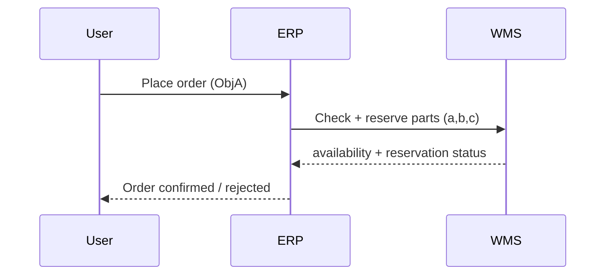

# ADR-002: Synchronous ERP–WMS Inventory Validation

**Status:** Accepted  
**Date:** 2026-03-10

---

## Context

When a user places an order for a product (e.g., `ObjA`), the ERP system expands the Bill of Materials (BOM) to determine which components are required for fulfillment.

Example:

ObjA requires:

- part `a`
- part `b`
- part `c`

Before the order can be confirmed, the system must determine whether the required parts are available in inventory and whether they can be reserved for the order.

The Warehouse Management System (WMS) is responsible for:

- tracking inventory levels
- validating part availability
- reserving inventory for confirmed orders

One architectural option is to perform this check asynchronously via events. However, during order placement the **user is actively waiting for confirmation**, which requires immediate feedback.

---

## Decision

The ERP will perform a **synchronous request–response call** to the WMS when validating an order.

The WMS evaluates inventory availability and attempts to reserve the required components for the order.

The WMS returns both:

1. **Availability status**
2. **Reservation outcome**

Possible responses include:

Availability:

- `AVAILABLE`
- `PARTIAL_AVAILABLE`
- `NOT_AVAILABLE`

Reservation:

- `RESERVED`
- `PARTIALLY_RESERVED`
- `NOT_RESERVED`

Only when the required inventory is successfully reserved can the ERP confirm the order and emit the `order.created` event that triggers downstream manufacturing.

---

## Interaction Flow (Synchronous)



---

## Example WMS Response

```json
{
  "order_id": "ORD-1001",
  "availability_status": "PARTIAL_AVAILABLE",
  "reservation_status": "PARTIALLY_RESERVED",
  "reserved_parts": [
    {"part_id": "a", "qty": 1},
    {"part_id": "b", "qty": 1}
  ],
  "missing_parts": [
    {"part_id": "c", "qty": 1}
  ],
  "reservation_expires_at": "2026-03-10T14:00:00Z"
}
```

---

## Alternatives Considered

### Asynchronous inventory validation

ERP would emit an order request event and wait for WMS to respond later via an event.

Pros:

- more decoupled architecture
- fully event-driven system

Cons:

- user must wait for asynchronous confirmation
- more complex order state management
- worse user experience

### Optimistic ordering (reserve later)

ERP could accept the order immediately and attempt inventory reservation afterward.

Pros:

- very fast order acceptance

Cons:

- risk of overselling inventory
- requires cancellation workflows if inventory is unavailable

---

## Consequences

### Positive

- Immediate feedback for users placing orders
- Prevents overselling inventory
- Clear ownership of inventory validation within WMS
- Simple order confirmation semantics

### Negative

- ERP is dependent on WMS availability and latency
- Slightly tighter coupling between ERP and WMS
- Not fully event-driven at the order validation boundary

---

## Notes

The synchronous ERP–WMS interaction is intentionally limited to the **order validation phase**.

After an order is accepted and inventory is reserved, the workflow transitions to the **asynchronous event-driven manufacturing pipeline** orchestrated by MES and the NATS JetStream event bus.
