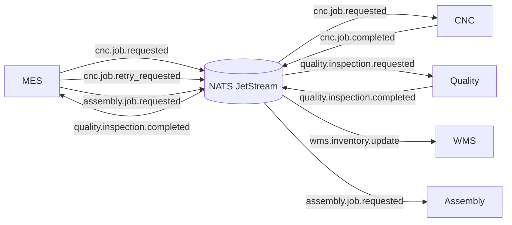

# ADR-003: MES as the Production Orchestrator

**Status:** Accepted  
**Date:** 2026-03-10

---

## Context

Once an order has been validated by ERP and inventory has been reserved by WMS, the system must execute the manufacturing workflow.

This workflow involves several systems:

- MES (Manufacturing Execution System)
- CNC machines (machining operations)
- Quality inspection systems
- Assembly systems

The system must determine:

- when production starts
- which machine should execute a job
- how to react to machine completion events
- how to handle quality failures
- when a part can proceed to assembly

Without a clear orchestration authority, multiple systems could attempt to make these decisions independently, leading to inconsistent manufacturing workflows.

---

## Decision

The **MES (Manufacturing Execution System)** will act as the central **production orchestrator**.

MES is responsible for:

- creating and tracking work orders
- dispatching machining jobs to CNC machines
- reacting to production events
- processing quality inspection outcomes
- determining whether parts proceed to assembly or require rework

All systems communicate through the **event bus (NATS JetStream)**.

CNC machines and Quality systems emit events, while MES consumes those events and determines the next production step.

---

## High-Level Manufacturing Flow



---

## Example Event: CNC Job Completed

```json
{
  "metadata": {
    "event_type": "cnc.job.completed",
    "event_id": "evt-cnc-001",
    "timestamp": "2026-03-10T10:24:05Z",
    "correlation_id": "corr-wo-501"
  },
  "workorder_id": "WO-501",
  "order_id": "ORD-001",
  "sku": "ObjA",
  "quantity": 2,
  "machine_id": "CNC-07",
  "duration_seconds": 245,
  "attempt": 1
}
```

## Example Event: Quality Inspection Completed

```json
{
  "metadata": {
    "event_type": "quality.inspection.completed",
    "event_id": "evt-qual-001",
    "timestamp": "2026-03-10T10:25:12Z",
    "correlation_id": "corr-wo-501"
  },
  "workorder_id": "WO-501",
  "order_id": "ORD-001",
  "sku": "ObjA",
  "inspected_quantity": 2,
  "passed_quantity": 1,
  "failed_quantity": 1,
  "disposition": "PARTIAL_REWORK",
  "failure_reasons": [
    {
      "qty": 1,
      "reason": "diameter_out_of_tolerance"
    }
  ],
  "attempt": 1
}
```

---

## Alternatives Considered

### CNC-driven workflow

CNC machines would determine whether to repeat operations or trigger downstream processes.

Pros:

- simpler MES responsibilities

Cons:

- machines are not designed to manage workflow logic
- poor visibility of production state
- difficult to coordinate multiple machines

### Quality-driven workflow

Quality systems could trigger rework or reprocessing directly.

Pros:

- faster reaction to failed inspections

Cons:

- Quality systems are not responsible for manufacturing orchestration
- introduces cross-system coupling

### Decentralized coordination

Each system independently reacts to events and decides the next action.

Pros:

- highly distributed system

Cons:

- difficult to maintain global production state
- increased risk of conflicting decisions

---

## Consequences

### Positive

- Clear ownership of production workflow logic
- Centralized tracking of work orders
- Easier scheduling and machine allocation
- Simplified retry and rework handling

### Negative

- MES becomes a critical system in the manufacturing pipeline
- Increased responsibility and complexity within MES
- Requires robust monitoring and fault tolerance

---

## Notes

MES is the natural orchestration layer for shop-floor operations in most manufacturing architectures.

By centralizing orchestration in MES while keeping machine execution and quality inspection independent, the system achieves both **operational control** and **loose coupling between manufacturing components**.
