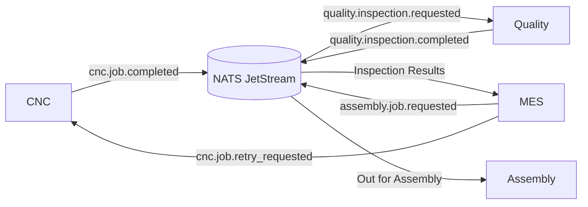

# ADR-004: Quality Results Published as Events

**Status:** Accepted  
**Date:** 2026-03-10

---

## Context

After CNC machines complete machining operations, produced parts must be inspected by a **Quality system** to ensure they meet required tolerances and specifications.

Inspection outcomes determine the next step in the manufacturing workflow:

- **PASSED** → the part proceeds to Assembly
- **FAILED (reworkable)** → the part must be reprocessed
- **FAILED (scrap)** → a new production cycle must be initiated

Several systems need access to inspection results:

- MES must decide whether to continue the workflow or trigger rework
- Analytics systems may track defect rates
- Monitoring systems may evaluate machine performance
- Traceability systems may store inspection history

A direct integration between Quality and MES (or Quality and CNC) would tightly couple the systems and limit the ability for other consumers to access inspection data.

---

## Decision

Quality inspection results will be **published as events** to the **NATS JetStream event bus**.

Systems that require inspection information subscribe to these events.

Primary consumer:

- **MES** – determines next workflow step (assembly or rework)

Possible additional consumers:

- Production analytics
- Machine performance monitoring
- Manufacturing traceability systems

This approach ensures that inspection data is available to all relevant systems without introducing tight coupling.

---

## Event Flow



---

## Example Event: Quality Inspection Completed

```json
{
  "metadata": {
    "event_type": "quality.inspection.completed",
    "event_id": "evt-qual-001",
    "timestamp": "2026-03-10T10:25:12Z",
    "correlation_id": "corr-wo-501"
  },
  "workorder_id": "WO-501",
  "order_id": "ORD-001",
  "sku": "ObjA",
  "inspected_quantity": 2,
  "passed_quantity": 1,
  "failed_quantity": 1,
  "disposition": "PARTIAL_REWORK",
  "failure_reasons": [
    {
      "qty": 1,
      "reason": "diameter_out_of_tolerance"
    }
  ],
  "attempt": 1
}
```

---

## Alternatives Considered

### Direct Quality → MES Integration

Quality systems could directly notify MES of inspection results.

Pros:

- simple integration
- low latency communication

Cons:

- tight coupling between Quality and MES
- difficult to add additional consumers of inspection data

### Quality → CNC Feedback Loop

Inspection results could be sent directly to the CNC system to trigger retries.

Pros:

- immediate machine-level feedback

Cons:

- CNC systems are not responsible for workflow orchestration
- production state becomes fragmented across systems

### MES Pulling Inspection Results

MES could periodically query the Quality system for inspection results.

Pros:

- simple architecture

Cons:

- inefficient polling
- delayed response to inspection outcomes

---

## Consequences

### Positive

- Loose coupling between Quality and other manufacturing systems
- Inspection data becomes reusable across multiple consumers
- Supports analytics, monitoring, and traceability
- Fits naturally within the event-driven architecture

### Negative

- Event-driven systems introduce eventual consistency
- Requires reliable event delivery and monitoring
- Debugging may require tracing events across multiple systems

---

## Notes

Publishing inspection outcomes as events allows the manufacturing system to remain modular and scalable.

MES remains responsible for workflow orchestration, while Quality systems focus exclusively on inspection and validation responsibilities.
