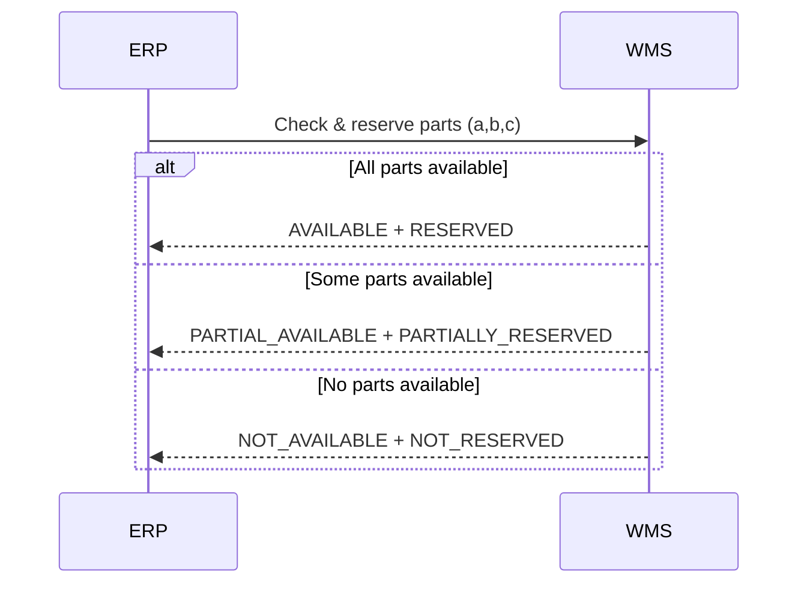

# ADR-005: Partial Inventory Reservation Model

**Status:** Accepted  
**Date:** 2026-03-10

---

## Context

When a user places an order for a product (e.g., `ObjA`), the ERP expands the Bill of Materials (BOM) to determine all required components.

Example:

ObjA requires:

- part `a`
- part `b`
- part `c`

The Warehouse Management System (WMS) is responsible for:

- validating inventory availability
- reserving parts for confirmed orders

However, it is possible that **not all required components are available at the same time**.

For example:

- `a` available
- `b` available
- `c` unavailable

A strict reservation model would reject the order immediately if all components are not available.

However, this approach can reduce order acceptance and waste available inventory that could be reserved while waiting for missing components.

---

## Decision

The WMS will support a **partial inventory reservation model**.

When an order is validated, the WMS evaluates:

1. **Availability status**
2. **Reservation status**

Availability statuses:

- `AVAILABLE`
- `PARTIAL_AVAILABLE`
- `NOT_AVAILABLE`

Reservation outcomes:

- `RESERVED`
- `PARTIALLY_RESERVED`
- `NOT_RESERVED`

If some components are available but others are missing, the WMS may **temporarily reserve available components** while the remaining parts are sourced.

Reservations include an **expiration timestamp** to prevent inventory from being locked indefinitely.

ERP can then decide whether to:

- accept the order and wait for missing components
- delay the order
- reject the order

---

## Reservation Flow



---

## Example Response (Partial Reservation)

```json
{
  "order_id": "ORD-1001",
  "availability_status": "PARTIAL_AVAILABLE",
  "reservation_status": "PARTIALLY_RESERVED",
  "reserved_parts": [
    {"part_id": "a", "qty": 1},
    {"part_id": "b", "qty": 1}
  ],
  "missing_parts": [
    {"part_id": "c", "qty": 1}
  ],
  "reservation_expires_at": "2026-03-10T14:00:00Z"
}
```

---

## Alternatives Considered

### Strict Reservation (All-or-Nothing)

Orders are accepted only if all components are immediately available.

Pros:

- simpler inventory logic
- avoids partially locked inventory

Cons:

- reduces order acceptance
- inefficient inventory utilization

### No Reservation Model

Orders are accepted without reserving inventory, and stock is allocated later.

Pros:

- very simple order acceptance process

Cons:

- risk of overselling inventory
- requires complex order cancellation workflows

---

## Consequences

### Positive

- Improves order acceptance rate
- Makes better use of available inventory
- Enables backorders and delayed fulfillment
- Provides flexibility for production planning

### Negative

- Increased complexity in WMS logic
- Requires reservation expiration handling
- Risk of temporary inventory fragmentation

---

## Notes

Partial reservation models are common in manufacturing and supply chain systems where complex product assemblies depend on multiple components that may not always be available simultaneously.

The reservation expiration mechanism ensures that inventory does not remain locked if the order cannot be fulfilled within a reasonable time window.
