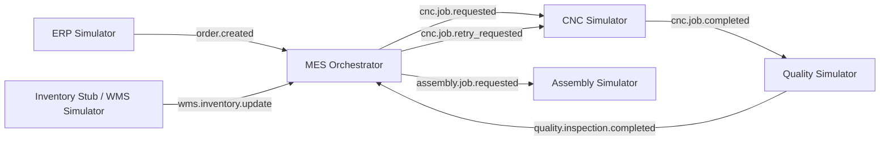

# PoC Scope — MES-Centric Event-Driven Manufacturing Integration

Status: Accepted

---

## Purpose
This document defines the scope of the Proof of Concept (PoC) for the aerospace manufacturing integration challenge.

The PoC will focus on **MES as the production orchestrator** in an **event-driven architecture**. The goal is to demonstrate how a traditional CSV/batch-driven workflow can be replaced by near-real-time event-based coordination between business systems and shop-floor processes.

This scope also clearly separates:

- **Actual working parts of the system** — services and logic that should be implemented and demonstrably functional
- **Simulated parts of the system** — external systems or factory components that will be mocked/emulated for the challenge

---

## Why MES is the PoC Focus
MES is the best PoC candidate because it sits at the center of the operational workflow and proves the highest-value architectural behavior:

- transforms incoming business demand into production activity
- orchestrates state transitions across manufacturing steps
- reacts to completion and quality results
- triggers next actions such as assembly, rework, or scrap
- provides the clearest demonstration of event-driven coordination

A CNC integration alone would demonstrate machine execution, but a **MES-centric PoC** demonstrates **system orchestration**, which better matches the challenge goal.

---

## PoC Objective
Build a small but realistic event-driven manufacturing workflow in which:

1. An order is accepted upstream
2. MES creates and tracks a production work order
3. MES requests machining
4. A simulated CNC worker completes the machining step
5. A simulated quality station publishes inspection results
6. MES decides the next path:
   - proceed to assembly
   - request rework / retry
   - mark as scrapped

The PoC should prove that the architecture can replace batch file handoffs with asynchronous, traceable events.

---

## In-Scope Business Scenario
The PoC will model the lifecycle of a single manufactured part or a small batch of parts.

### Core scenario
- Customer/manufacturing demand is accepted
- Material/inventory is considered available or reserved
- MES creates a work order
- MES dispatches machining
- CNC processing is completed
- Quality inspection is performed
- MES routes the part based on inspection outcome

### Supported outcomes
- **PASS** → part moves forward to assembly
- **REWORK** → MES requests another machining attempt
- **SCRAP** → MES closes the work order with failure status

---

## Actual Working Parts of the System
These parts should be implemented as real, functioning components in the PoC.

## 1. Event Bus / Messaging Layer
A real event broker should be used.

### Responsibilities
- publish and consume domain events
- persist events where possible
- support retries / redelivery
- allow event replay for demonstration or recovery

### Implementation
- **NATS JetStream**: [official docs](https://docs.nats.io/nats-concepts/jetstream)

---

## 2. MES Orchestrator Service
This is the main service of the PoC.

### Responsibilities
- consume upstream events such as `order.created`
- create production work orders
- persist work order state
- emit `cnc.job.requested`
- consume machining completion events
- consume quality result events
- decide next routing step
- emit downstream outcome events

### Example work order states
- `CREATED`
- `MATERIAL_CONFIRMED`
- `MACHINING_REQUESTED`
- `MACHINING_COMPLETED`
- `QUALITY_PENDING`
- `PASSED`
- `REWORK_REQUESTED`
- `SCRAPPED`
- `READY_FOR_ASSEMBLY`

---

## 3. State Store / Persistence Layer
A real persistence mechanism should be used for traceability and demo clarity.

### Responsibilities
- store work orders
- store event processing references / correlation ids
- store current state and audit trail
- support idempotency checks if implemented

### Suggested implementation
- PostgreSQL or lightweight SQL store

### HOWEVER
- For a PoC, the implementation is limited and an in-memory store is used

---

## 4. Inventory Validation / Reservation Stub Service
This may be minimal but should still work as a real service or real module.

### Responsibilities
- accept an incoming request or event indicating material availability
- confirm reservation for the work order
- emit a confirmation event used by MES

### Suggested simplification
The logic can be intentionally simple:
- always reserve successfully
- or use a small hardcoded inventory table

---

## 5. Observability / Demo Visibility Layer
At least lightweight operational visibility should exist.

### Recommended options
- structured logs
- event trace output
- simple dashboard / CLI viewer / status endpoint
- sequence view of work order progression

---

## Simulated Parts of the System
These parts should be emulated rather than deeply integrated.

## 1. ERP
ERP should be simulated as the upstream source of accepted production demand.

### Simulation behavior
- emits `order.created`
- optionally includes item id, quantity, due date, priority

### Why simulated
ERP is not the architectural focus of the PoC. Fully modeling enterprise order management adds noise without proving more of the target design.

---

## 2. WMS
WMS is a warehouse logic is too large for a challenge PoC and is not necessary to prove orchestration. Therefore, it is completely skipped. The idea is to have a REST API style implementation for this, refer: [ADR-002](ADRs/ADR-002-sync-erp-wms-inventory-validation.md).

---

## 3. CNC / Machine Layer
The CNC system should be represented by a worker service or simulator.

### Simulation behavior
- consumes `cnc.job.requested`
- waits for a short delay (simulating the "actual" working)
- emits `cnc.job.completed`
- may occasionally emit a machine failure event in an extended demo

### Why simulated
Real CNC connectivity is highly factory-specific and likely depends on protocols, hardware, and machine controllers not available in the challenge environment.

### Important note
Although simulated, this component should behave like an external asynchronous system, not like an internal function call.

---

## 4. Quality Inspection Station
Quality should be simulated as a station or service that returns deterministic or configurable inspection outcomes.

### Simulation behavior
- consumes `quality.inspection.requested`
- emits `quality.inspection.completed`

### Why simulated
The purpose is to demonstrate routing decisions, not to build a real metrology or computer-vision system.

---

## 5. Assembly System
Assembly should be treated as a downstream consumer only.

### Simulation behavior
- consumes `assembly.job.requested`
- logs that the part is ready for the next process

### Why simulated
Assembly is outside the main PoC boundary and only needs to prove that MES can hand off successfully.

---

## Event Flow in Scope
The following event flow (high-level) is supported.

---

## Minimal Event Contract Set
The PoC does not need a huge catalog. A small, coherent set is enough.

### Upstream events
- `order.created`
- `wms.inventory.update`

### MES outbound events
- `cnc.job.requested`
- `cnc.job.retry_requested`
- `assembly.job.requested`
- `cnc.job.scrapped`
- `workorder.status.changed` *(optional but useful for visibility)*

### External process events
- `cnc.job.completed`
- `quality.inspection.completed.pass`
- `quality.inspection.completed.rework`
- `quality.inspection.completed.scrap`

---

## Recommended PoC Boundaries
To keep the challenge manageable, the PoC should intentionally avoid overbuilding.

### Keep these simple
- one part family or SKU
- one machining step
- one inspection step
- one assembly handoff
- one inventory confirmation path
- simple retry limit such as max 1 or max 2 rework attempts

### Do not model in depth
- detailed BOM explosion
- real machine protocol integration
- multi-site warehouse logic
- advanced scheduling optimization
- human operator workflows
- authentication / authorization beyond minimal setup
- complex UI unless time remains

---

## Success Criteria
The PoC is successful if it can clearly demonstrate the following:

1. **An order can trigger production without CSV batch files**
2. **MES creates and tracks a work order with durable state**
3. **Machining is requested through events, not direct coupling**
4. **Quality outcomes drive branching logic**
5. **At least one rework path is supported**
6. **A successful part reaches the assembly handoff event**
7. **The flow is observable and easy to explain in a demo**

---

## Nice-to-Have Extensions
These should only be added if the core flow already works.

- dead-letter handling
- replay of events from JetStream
- idempotent consumer handling
- correlation ids and trace ids across all events
- negative inventory path
- machine failure path
- small dashboard showing work order timeline

---

## Out of Scope
The following are explicitly out of scope for this PoC:

- full ERP implementation
- full WMS implementation
- real CNC machine protocol integration
- actual PLC / SCADA connectivity
- advanced production planning and finite-capacity scheduling
- real quality measurement hardware integration
- full assembly execution system
- enterprise-grade security, IAM, and compliance scope beyond minimal demo setup

---

## Suggested Deliverable Structure
The challenge output can be presented in three layers.

## 1. Architecture layer
- high-level diagram
- event flow diagram
- component responsibility summary

## 2. Working PoC layer
- real broker
- real MES service
- real persistence
- simulated external services

## 3. Decision layer
- ADRs explaining:
  - event-driven backbone choice
  - MES as orchestrator
  - quality as asynchronous event producer
  - inventory reservation approach
  - migration away from CSV batch workflows

---

## Recommended Demo Script
A concise demo story could be:

1. Start broker, MES, DB, and simulators
2. Publish `order.created`
3. Show MES creates a work order
4. Show inventory confirmation
5. Show MES emits `cnc.job.requested`
6. Show CNC simulator emits completion
7. Show QA simulator returns:
   - first run = rework
   - second run = pass
8. Show MES emits `assembly.job.requested`
9. Show final work order state in DB or viewer

This demonstrates orchestration, retry behavior, and the value of event-driven processing in a compact narrative.

---

## Final Recommendation
The PoC should be positioned as:

> **A MES-centric event-driven orchestration PoC with simulated shop-floor and enterprise edge systems.**

This gives the best balance of:
- architectural depth
- business realism
- manageable implementation scope
- strong challenge presentation value

